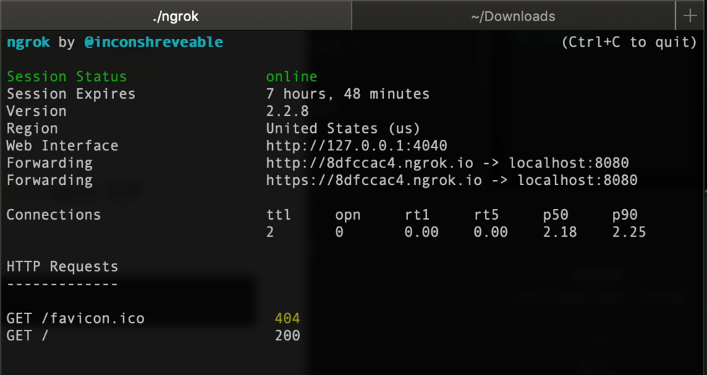

# MAC下使用免费实现内网穿透

## 一、环境
MacOS Mojava(此条件非必须)

## 二、[ngrok](https://ngrok.com/)

下载地址：[https://ngrok.com/download](https://ngrok.com/download)

## 三、使用

1、下载之后直接解压得到 一个 ngrok 文件

2、直接终端运行

```
chmod a+x ngrok
```

即可修改权限。

3、开启服务

```
./ngrok http localhost:8080
```

4、结果如下：


5、http、https服务器即可通过手机4G网络访问：

```
http://8dfccac4.ngrok.io
https://8dfccac4.ngrok.io
```

## 四、问题

需要主要的是！！！！➜ 必须开启web服务

若没开启出现如下错误：

```
**Failed to complete tunnel connection**

The connection to [**https://8dfccac4.ngrok.io**](https://8dfccac4.ngrok.io/) was successfully tunneled to your ngrok client, but the client failed to establish a connection to the local address [**localhost:8080**](http://localhost:8080/).

Make sure that a web service is running on [**localhost:8080**](http://localhost:8080/) and that it is a valid address.

The error encountered was: **dial tcp** [**::1**]**:8080: getsockopt: connection refused**
```